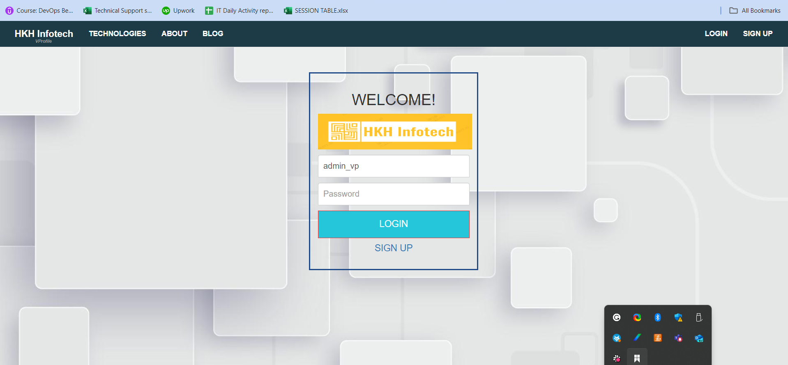

# DEPLOYING JAVA STACK APPLICATION USING LOCAL VM 

**PROJECT SETUP**

**Prerequisite:**
1. Oracle VM Virtualbox

2. Vagrant

3. Vagrant plugins
Execute below command in your computer to install hostmanager plugin
$ vagrant plugin install vagrant-hostmanager

4. Git bash or equivalent editor
  
  1. Clone source code.
  2. Cd into the repository.
  3. Switch to the main branch.
  4. cd into vagrant/Manual_provisioning
 
Bring up vm’s

 **$ vagrant up**

NOTE: Bringing up all the vm’s may take a long time based on various factors.
If vm setup stops in the middle run “vagrant up” command again.
INFO: All the vm’s hostname and /etc/hosts file entries will be automatically updated.

**Services:**

1. Nginx      : Loadbalancer
2. Tomcat     : Java application Server
3. Memcache   : DB Caching
4. RabbitMQ   : Brocker/Queuing Agent
5. MySQl      : SQL Database

**This project is divided into 2 sessions:**

1. Manual deployment
2. Automated deployment

## Manual Deployment

* Virtual box is hosted on windows system, while vagrant is used to deploy infrasture.

* Deployment of infrastructure via vagrant is automatic, while apps and configurations are manual.

* The manual detailed implementation procedure for a windows host is found [here](vagrant/Manual_provisioning_WinMacIntel/VprofileProjectSetupWindowsAndMacIntel.pdf)

* [Vagrantfile](vagrant/Manual_provisioning_WinMacIntel/Vagrantfile)

## Automated deployment

For fully automated deployment both infrastures and applications were automated.

**Vagrantfile** were used to deploy the insfrastures. The provisioning part of vagrantfile were added to call the shell script file. [Here](vagrant/Automated_provisioning_WinMacIntel/Vagrantfile) is vagrantfile used

* Applications, services and configurations were done using **bash script**

* Bash script is [here](vagrant/Automated_provisioning_WinMacIntel)

**Final project website:**

